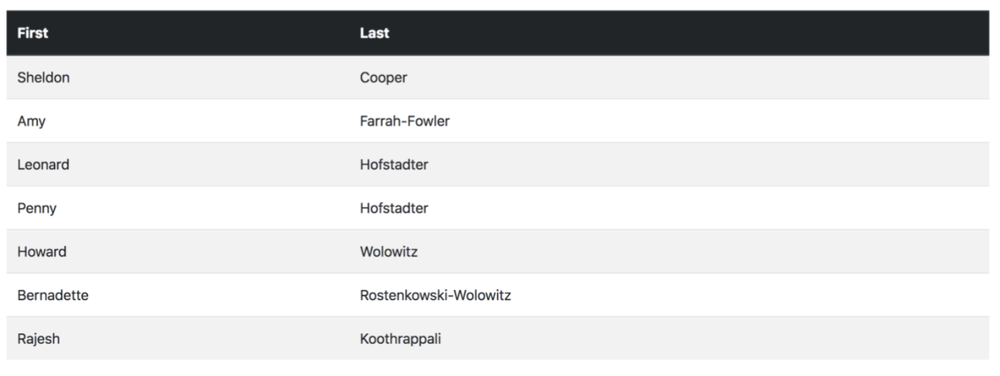
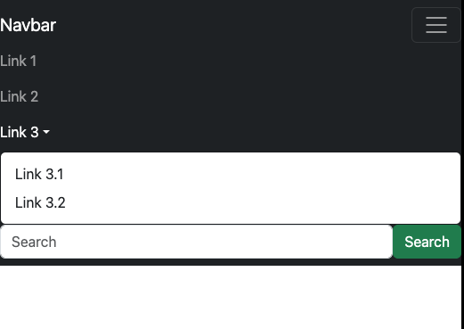
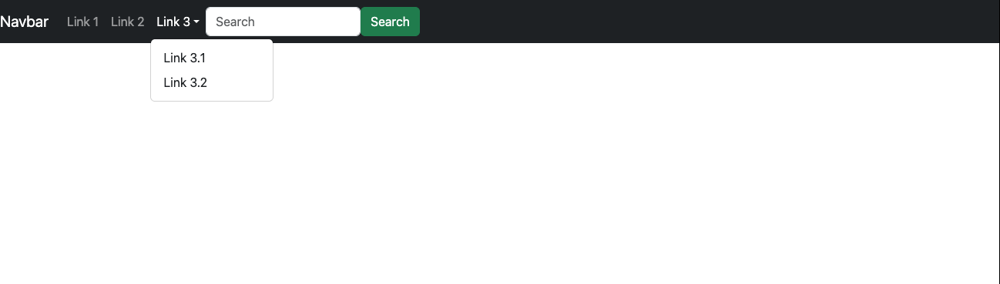
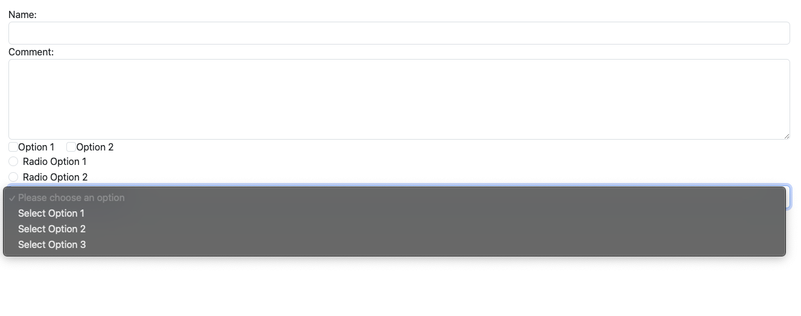
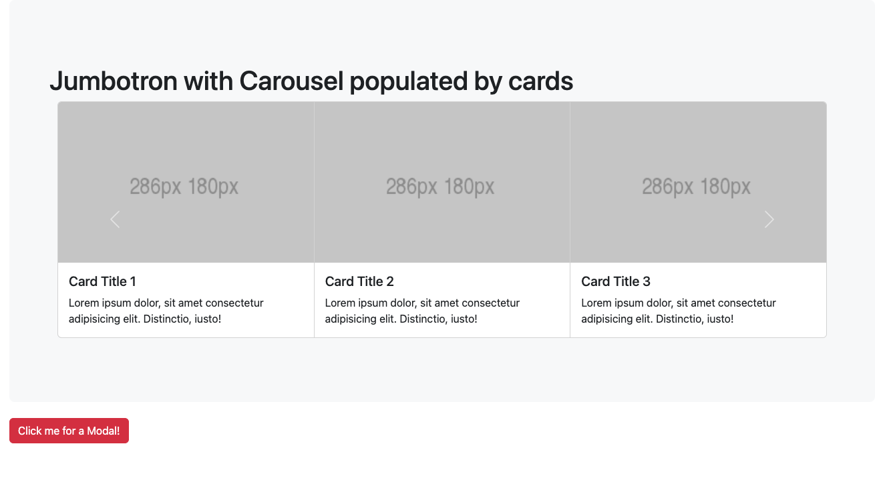
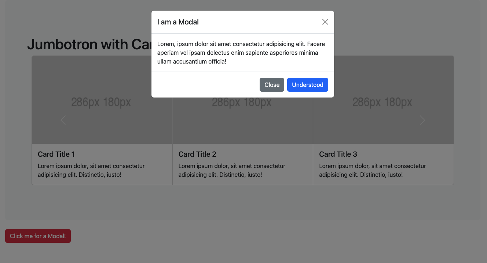

# Bootstrap Quick Labs

## Quick Labs Environment Set-Up

1. Open **VSCode**.
2. Using **File** → **Open** , navigate to the **Quick Labs** folder and click **Open**. This will give
    you access to all of the Quick Lab files and solutions needed to complete the Quick
    Labs.
3. At the bottom of the **VSCode** window, you should see a **Go Live** icon. Click on this
    will launch **live-server** for the currently selected file or folder. If a folder is selected,
    this will be shown in your browser and you will be able to navigate here. If a file is
    selected, the browser will attempt to display the file.

---

## Quick Lab 1 - Bootstrap Basics

### Objectives - Quick Lab 1

- Experiment with the .container and .container-fluid classes

### Activity 1

1. Open the file **index.html** from the **QuickLabs/01_BasicBootstrap/starter** folder using **live-server** *(Please see step 3 of setting up the environment for help on this)*.
2. View the page in the browser and note the position of the text.
3. Open the developer tools and experiment with what happens to the text when the
    width of the page is changed (using the Device view on Responsive).
4.
   1. In the code for the page, add the following tag to the header to include Bootstrap's
    CSS on the page:

```html
<link href="https://cdn.jsdelivr.net/npm/bootstrap@5.3.2/dist/css/bootstrap.min.css" rel="stylesheet" integrity="sha384-T3c6CoIi6uLrA9TneNEoa7RxnatzjcDSCmG1MXxSR1GAsXEV/Dwwykc2MPK8M2HN" crossorigin="anonymous">
```

    2. Add the follwing tag to the header to include Bootstrap's JavaScript on the page:

```html
<script src="https://cdn.jsdelivr.net/npm/bootstrap@5.3.2/dist/js/bootstrap.bundle.min.js" integrity="sha384-C6RzsynM9kWDrMNeT87bh95OGNyZPhcTNXj1NW7RuBCsyN/o0jlpcV8Qyq46cDfL" crossorigin="anonymous"></script>
```

5. Add a class of **container** to the **main** element.
6. Save and view the page in the browser again and notice the change in position,
    experimenting with the device width.
7. Change the class to **container-fluid**.
8. Save and view the page in the browser again and notice the change in position,
    experimenting with the device width.

> This is the end of QuickLab 1

---

## Quick Lab 2 - Bootstrap Grids

### Objectives

- To use the Bootstrap Grid classes to control the layout on different devices

### Activity

1. Open the file **index.html** from the **QuickLabs/02_BootstrapGrids/starter** folder
    using **live-server** *(Please see step 3 of setting up the environment for help on this)*.
2. In the code add:
   - A *class* of `container` to the `main` element;
   - A `div` with a *class* of `row` inside `main` which contains:
     - *4 divs*, each with a *class* of `col` and some text content to identify it (e.g. Col 1, etc)
3. Save the file and view in the browser.

You should see 4 evenly sized columns that stack once the width of the screen becomes
too small to display the columns evenly with the content.

4. Add another `div` with a *class* of `row` beneath the closing tag of the *previous div with a class of `row`*.
5. In this `div`, add *4 divs* that have:
   - A *class* of `col-md-3`
   - Some text content to identify it (e.g. Col 1, etc)
6. Save the file and view in the browser.

You should notice that whilst the screen width is greater than 768px the columns behave
the same. Once the screen is less than 768px, the second row stacks itself one on top of
the other.

7. Add a further `div` with *class* `row` to the `main` element.
8. Inside this, add *2 divs* that *span the row* in a *5-7* ratio on a small screen device.
9. Save the file and view in the browser.

You should notice that the final row is slightly offset to the others (due to the 'odd' nature
of the split) and remains so until the screen width becomes `576px` or less, at which point it
stacks.

10. Add a final `div` with *class* `row` to the `main` element.
11. Inside this, add *12 divs* that have:
    - Classes `col-12` `col-sm-6` `col-md-3` `col-lg-1`
    - Some text content to identify it (e.g. Col 1, etc)
12. Save the file and view it in the browser.

This creates a multi-step layout for different device sizes commonly used with Bootstrap.

> This is the end of QuickLab 2

---

## Quick Lab 3 - Bootstrap Text, Colour and Images

### Objectives - Quick Lab 3

- To style text and images using Bootstrap

### Activity 3

1. Open the file **index.html** from the
    **QuickLabs/03_BootstrapTextColoursImages/starter** folder using **live-server** *(Please*
    *see step 3 of setting up the environment for help on this)*.
2. Using the appropriate Bootstrap classes on the provided paragraph elements, style
    them as the text requests them to be.
3. Using the appropriate Bootstrap classes on the 3 provided image elements, style
    them as their figcaption suggests.

> This is the end of QuickLab 3

---

## Quick Lab 4 - Bootstrap Tables

### Objectives - Quick Lab 4

- Create a responsive navbar with a dropdown option and a search box/button

### Activity 4

1. Open the file **index.html** from the **QuickLabs/04_BootstrapTables/starter** folder using **live-server** *(Please see step 3 of setting up the environment for help on this)*.
2. Using the image below as a guide, experiment with the table classes for Bootstrap to style the provided table. The table should be responsive on medium  screen devices and smaller.



> This is the end of QuickLab 4

---

## Quick Lab 5 - Bootstrap Navbars

### Objectives - Quick Lab 5

- Create a responsive navbar with a dropdown option and a search box/button

### Activity 5

1. Open the file **index.html** from the **QuickLabs/05_BootstrapNavigation/starter** folder using **live-server** *(Please see step 3 of setting up the environment for help on this)*.
2. In the **`<body>`** add a navigation bar that has:
    - A brand of Navbar;
    - 2 ordinary links and a link that is a dropdown that has 2 further links;
    - A search input box and search button;
    - Collapses the menu to a button on medium screens and smaller.

#### Steps

1. Add a `<nav>` with *classes* of `navbar` , `navbar-expand-md` , `bg-dark` and `navbar-dark`
2. Inside `<nav>` add:
   1. An `<a>` with a *link* to `"#"` with a *class* of `navbar-brand`
   2. A `<button>` with a *class* of `navbar-toggler`, *type* of `button`, `data-bs-toggle` of `collapse`, attribute `data-bs-target` with value `#collapsibleNavbar`,  `aria-controls` with value `collapsibleNavbar`, `aria-expanded` with value `false` and `aria-label` with value `Toggle navigation`
   3. A `<span>` inside the button with a *class* of `navbar-toggler-icon`
   4. A `<div>` with an id of `collapsibleNavbar` and classes of `collapse` and `navbar-collapse`
   5. A `<ul>` inside the `<div>` that has a *class* of `navbar`
   6. 2 `<li>` elements with a *class* of `nav-item` that each contain an `<a>` element with a *class* of `nav-link` , a *link* to `"#"` and *text* of `Link 1` , etc
   7. An `<li>` with *classes* of `nav-item` and `dropdown`
   8. An `<a>` inside the `<li>` that has *classes* of `nav-link` and `dropdown-toggle`, an *attribute* `data-bs-toggle` set to `dropdown`, an attribute `role` set to `button`, `aria-expanded` set to `false` and *text* of `Link 3`
   9. A `<ul>` under the `<a>` that has a *class* of `dropdown-menu`
   10. 2 `<li>` elements each with an `<a>` element inside, the `<a>` elements should have *class* of `dropdown-item` , *linked* to `"#"` and *text* of `Link 3.1` , etc
   11. Still inside the `<div>`, a `<form>` with an *role* of `search` and a *class* of `d-flex`
   12. In the `<form>`, an `<input>` of *type* `search` , *placeholder* of `Search`, *classes* of `form-control` and `mr-sm-2` and an `aria-label` of `Search`
   13. An `<input>` of *type* `submit` , *value* of `Search` and *classes* of `btn` and `btn-success`.

Once you have completed the navbar, view it in the browser and make sure it works as
expected.

Smaller Screen Output:



Larger Screen Output:



> This is the end of QuickLab 5

---

## Quick Lab 6 - Bootstrap Forms

### Objectives - Quick Lab 6

- To be able to style a form using Bootstrap

### Activity 6

1. Open the file **registration.html** from the **QuickLabs/06_BootstrapForms/starter**
    folder using **live-server** *(Please see step 3 of setting up the environment for help on this)*.
2. Add appropriate Bootstrap classes to the form to make it look like the form shown below.



### NOTES

> - The checkboxes are inline
> - The select is created as a custom form element.
>
> This is the end of QuickLab 6

---

## Quick Lab 7 - Bootstrap Components

### Objectives - Quick Lab 7

- To understand classes and attributes needed to use simulate Bootstrap 4- jumbotrons and implement Bootstrap 5 carousels, cards and modals

### Activity 7

1. Open the file **registration.html** from the
    **QuickLabs/07_BootstrapComponents/starter** folder using **live-server** *(Please see step 3 of setting up the environment for help on this)*.
2. Examine the code supplied - there are a number of comments to indicate where you need to add Bootstrap code - you can get the example code from the Bootstrap documentation.
3. The completed page should have a jumbotron that has a carousel with 3 slides - each slide has 3 identical cards on it. Beneath the jumbotron, there should be a button that opens a modal.  The modal should have a static backdrop and should not close when it is clicked on (i.e. it should only close when the close button is clicked).

This is how the outputs should look:




> This is the end of QuickLab 7
