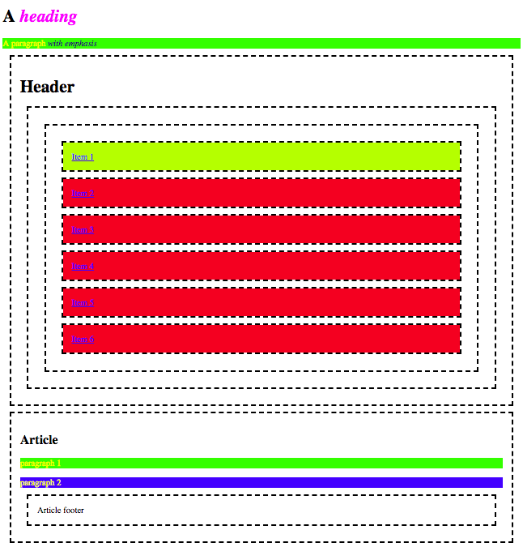
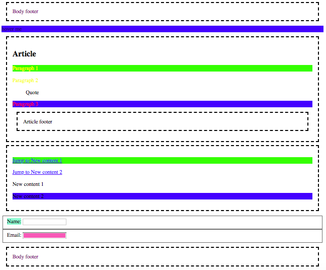
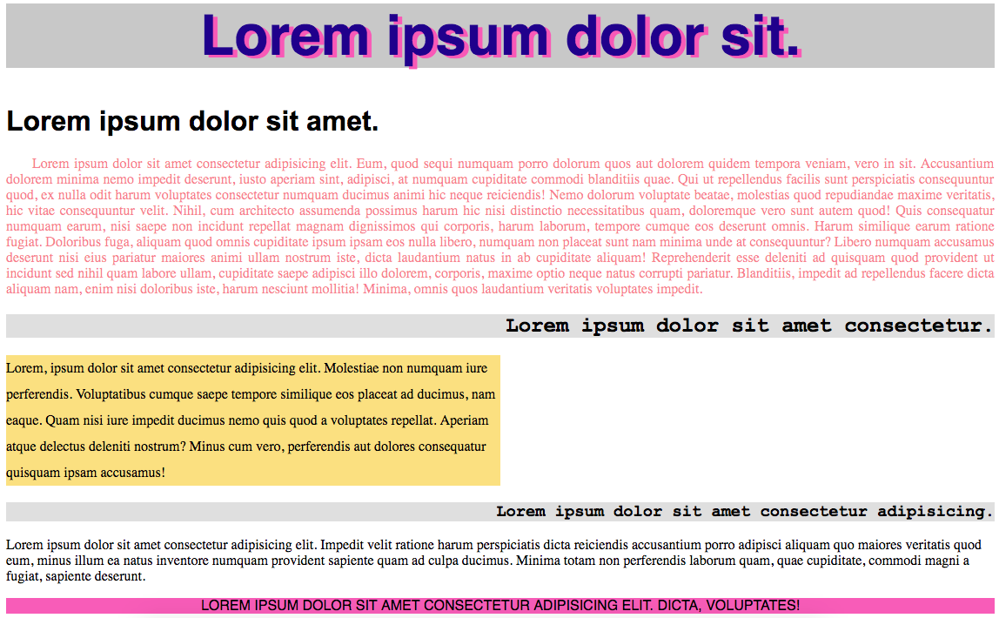
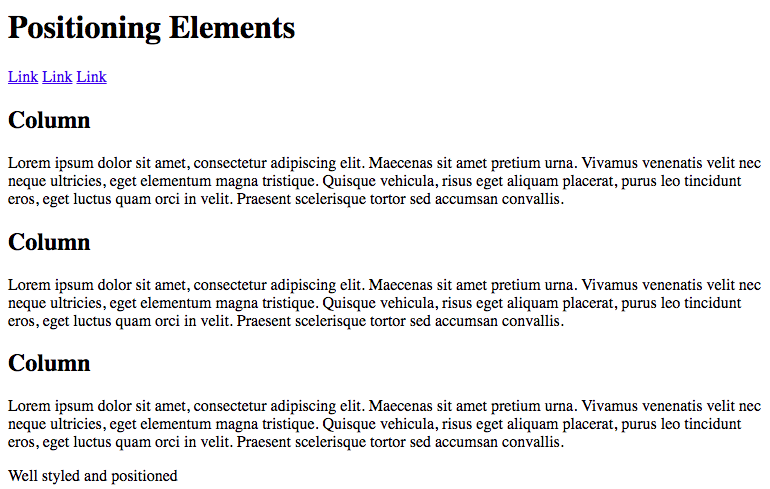
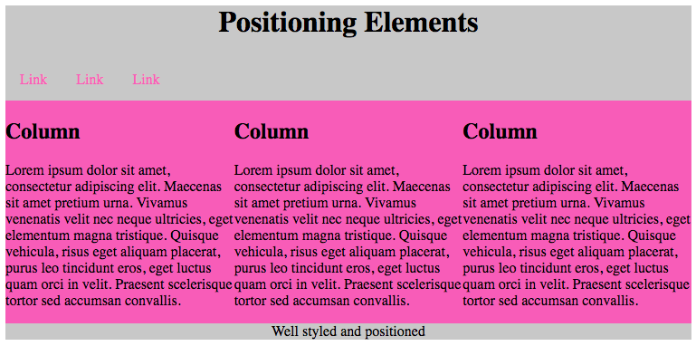
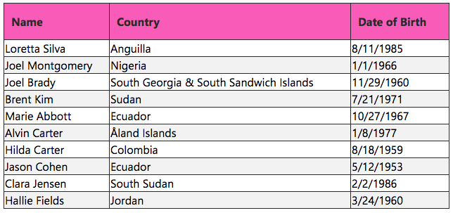
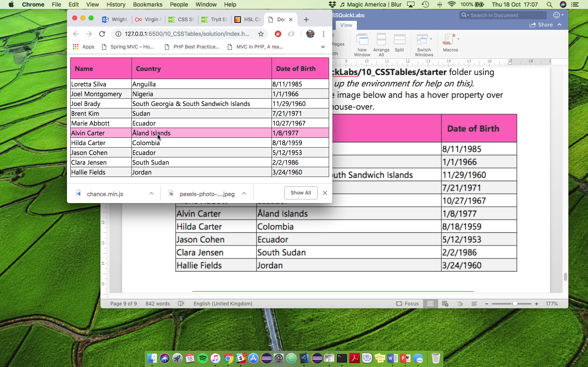

# Web Fundamentals - CSS Quick Labs

[Quick Labs Environment Set-Up](#_Toc335129559)

[Quick Lab 6 - CSS Selectors](#_Toc527646559)

[Quick Lab 7 - Text, Colours and Sizing](#_Toc527646560)

[Quick Lab 8 - Images and Backgrounds](#_Toc527646561)

[Quick Lab 9 - Positioning Elements](#_Toc527646562)

[Quick Lab 10 - Tables](#_Toc527646563)

## Quick Labs Environment Set-Up

1. Open **VSCode**.

2. Using **File Open**, navigate to the **Quick Labs** folder and click
    **Open**. This will give you access to all of the Quick Lab files
    and solutions needed to complete the Quick Labs.

3. At the bottom of the **VSCode** window, you should see a **Go Live**
    icon. Click on this will launch **live-server** for the currently
    selected file or folder. If a folder is selected, this will be shown
    in your browser and you will be able to navigate here. If a file is
    selected, the browser will attempt to display the file.

---

## Quick Lab 6 - CSS Selectors

### Objectives 6

- Use CSS selectors to apply styling to particular elements

### Activity 6

1. Open the file **index.html** from the **QuickLabs/06\_Selectors/starter** folder using **live-server** *(Please see step 3 of setting up the environment for help on this)*.

2. Apply an appropriate selector for the element(s) specified in the comment to the styling rule before it on each line.

3. When you have completed the first set of list-item styling check the     output.

4. Your finished product should look like the image below. Inspect elements to find out what happened to styles that are not shown…

> This is the end of Quick Lab 6

---

## Quick Lab 7 - Text, Colours and Sizing

### Objectives 7

- Experiment with adding colours and sizing to text and other elements

### Activity 7

1. Open the file **index.html** from the
    **QuickLabs/07\_TextColourSizing/starter** folder using
    **live-server***(Please see step 3 of setting up the environment for
    help on this)*.

2. Apply these styling rules to the text:

| Element | Styles |
| :- | :- |
| `h1` inside a header | A shadow that is hotpink, set 5px horizontal and 3px vertical |
| | Text colour set to darkblue |
| | A font family of Helvetica |
| | A background colour set to grey of `200`, `200`, `200`, an `1` on the `rgba` scale |
| | A font size of point `48` |
| | Centre the display of the text |
| `h1` | A font family of Arial |
| | A font size set to `2` x the relative (`em`) |
| A `p` with a class of `first` | Indent the text by `30` pixels |
| | Set the colour to be red with half transparency |
| | Make the text fill the row (i.e. justify) |
| `h2` and `h3` | Align the text to the right |
| | Use the Courier New font |
| | Have a background of a mid-grey with half transparency |
| A `p` with an `id` of `highlightme` | Set the background with a Hue of `45`, a Saturation of `100%` and a Lightness of `50%`. It should be half transparent too |
| | Space the lines by `30px` |
| | Occupy `50%` of the available width |
| A `p` directly inside a `footer` | A background colour of hotpink (set as a `HSLA` value) |
| | Use any sans-serif font |
| | Centre the text |
| | Make the text uppercase |

Your finished product should look like the image below:

> This is the end of Quick Lab 7

---

### Quick Lab 8 - Images and Backgrounds

## Objectives 8

- Format images on pages

- Use CSS to add background images to elements on pages

### Activity 8

1. Open the file **team.html** from the
    **QuickLabs/08\_ImagesBackgrounds/starter** folder using
    **live-server***(Please see step 3 of setting up the environment for
    help on this)*.

2. Add a CSS rule that makes the image occupy 50% of the available
    space.

3. Apply an image background to the **div** with an **id** of
    **hasBackground**. It should

    - Use the image named **pexels-photo-370799.jpg**;

4. Experiment with the **repeat** and **position** attributes;

> This is the end of Quick Lab 8

---

## Quick Lab 9 - Positioning Elements

## Objectives 9

- Use floats, clears and other positioning and sizing properties to
    lay out a page

### Activity 9

1. Open the file **index.html** from the **QuickLabs/09\_PositioningElements/starter** folder using **live-server** *(Please see step 3 of setting up the environment for help on this)*.

2. Turn the top image into the bottom image:

From this:

To this:

3. Guidance on CSS rules to create:

| Element or group | Items to set | Values to use |
| :- | :- | :- |
| `header` and `footer` | `background-colour` | `rgba(200, 200, 200, 1)` |
| | `text-align` | `center` |
| | `clear` | `both` |
| `nav` | `width` | `100%` |
| | `height` | `46px` |
| Links in a `nav` | `float` | `left` |
| | `display` | `block` |
| | `color` | `hsla(300, 100%, 71%, 1)` |
| | `text-align` | `center` |
| | `padding` | `14px, 16px` |
| | `text-decoration` | `none` |
| Hovered links in a `nav` | `background-color` | `hsla(300, 100%, 71%, 1)` |
| | `color` | `black` |
| Element with `id` of `row` | `clear` | `both` |
| Elements with `class` of `column` | `float` | `left` |
| | `width` | `33.33%` |
| | `background-color` | `hsla(300, 100%, 71%, 1)` |

> This is the end of Quick Lab 9

---

## Quick Lab 10 - Tables

### Objectives 10

- To be able to format a table using CSS

### Activity 10

1. Open the file **index.html** from the
    **QuickLabs/10\_CSSTables/starter** folder using
    **live-server***(Please see step 3 of setting up the environment for
    help on this)*.

2. Format the table so that it looks like the image below:

3. Ensure that the table has a hover property that highlights each row as the mouse pointer is over it as shown

4. The following information may help:

| Element or group | Items to set | Values to use |
| :- | :- | :- |
| `table` | `font-family` | `'Segoe UI', Tahoma, Geneva, Verdana, sans-serif` |
| | `border-collapse` | `collapse` |
| | `width` | `100%` |
| `th` and `tr` | `border` | `1px solid hsla(0, 0%, 17%, 1)` |
| | `text-align` | `left` |
| `th` | `padding` | `15px 10px` |
| | `background-color` | `hsla(330, 100%, 71%, 1)` |
| | `color` | `hsla(0, 0%, 17%, 1)` |
| Even `tr` elements | `background-color` | `hsla(0, 0%, 74%, 0.2)` |
| Hovered `tr` elements | `background-color` | `hsla(330, 100%, 71%, 0.5)` |

> This is the end of Quick Lab 10

---
