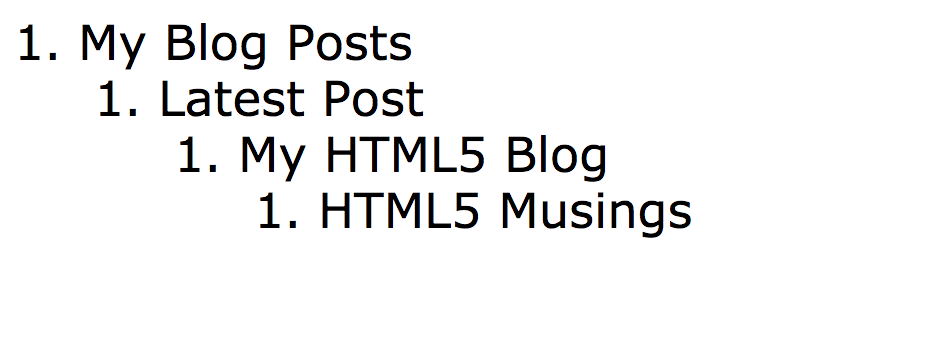

# Web Fundamentals - HTML Quick Labs

[Quick Labs Environment Set-Up](#_Toc526346544)

[Quick Lab 1 - Structural HTML](#_Toc526346545)

[Quick Lab 2 - Hyperlinks](#_Toc526346546)

[Quick Lab 3 - Images](#_Toc526346547)

[Quick Lab 4 - Tables](#_Toc526346548)

[Quick Lab 5 - Forms](#_Toc526346549)

## Quick Labs Environment Set-Up

1. Open **VSCode**.

2. Using **File Open**, navigate to the **Quick Labs** folder and click
    **Open**. This will give you access to all of the Quick Lab files
    and solutions needed to complete the Quick Labs.

3. At the bottom of the **VSCode** window, you should see a **Go Live**
    icon. Click on this will launch **live-server** for the currently
    selected file or folder. If a folder is selected, this will be shown
    in your browser and you will be able to navigate here. If a file is
    selected, the browser will attempt to display the file.

---

## Quick Lab 1 - Structural HTML

### Objectives 1

- Use structural elements appropriately

### Activity 1

1. Open the file **index.html** from the
    **QuickLabs/01\_StructuralHTML/starter** folder using
    **live-server** or similar *(Please see step 3 of setting up the environment
    for help on this)*.

2. Replace any element with an *appropriate structural element*.

3. Once you have finished, check your outline matches the one below by
    testing the HTML structure on the website:

<https://gsnedders.html5.org/outliner/>

> This is the end of Quick Lab 1

---

## Quick Lab 2 - Hyperlinks

### Objectives 2

- Use hyperlinks to create links between pages and actions

### Activity 2

1. Open the file **index.html** from the
    **QuickLabs/02\_Hyperlinks/starter** folder using
    **live-server***(Please see step 3 of setting up the environment for
    help on this)*.

2. Create a new file in the same folder called **courses.html**.

3. In this file, skeleton an HTML page and then insert the text
    provided in **courses.txt** into the body.

4. Create a link from **index.html** to **courses.html** and vice
    versa. Check that these links work.

5. Add a *link to send an email* to the webmaster at the bottom of
    **index.html** and put this footer on the courses page too.

> This is the end of Quick Lab 2

---

## Quick Lab 3 - Images

### Objectives 3

- Insert images into pages

### Activity 3

1. Open the file **team.html** from the
    **QuickLabs/03\_Images/starter** folder using
    **live-server***(Please see step 3 of setting up the environment for
    help on this)*.

2. Locate the comments and insert the image in place of the comment for the 4 images provided.

3. The image **theTeam** causes the horizontal scroll bar to appear.
    Make this disappear by adding an appropriate attribute to the image.

> This is the end of Quick Lab 3

---

## Quick Lab 4 - Tables

### Objectives 4

- Create a table to contain data with appropriate tagging

### Activity 4

1. Open the file **index.html** from the
    **QuickLabs/04\_Tables/starter** folder using
    **live-server***(Please see step 3 of setting up the environment for
    help on this)*.

2. First of all, orientate yourself with the code. You’ll see the
    course content within the html file, but it has no markup to
    describe how it should be laid out – so as you can imagine, the page
    is a bit of a mess.

3. The first step is to add our **&lt;table&gt;** tags around the data
    we want tabulated.

4. Now break up the content into its logical rows using the
    **&lt;tr&gt;** tag you’ve learnt about already. You may be able to
    see what data should be on each row – but if not then ask your
    instructor for some guidance.

5. Finally, you want to now split each row into its various ‘columns’
    by wrapping each piece of data in **&lt;td&gt;** tags.

So, we’ve gone from an illegible string of data, to highly structured,
coherent table. For a bit of polish, let’s tidy our code up a bit.

6. Without headings our table is ambiguous so before the first row, add
    in another row and create a header for each column using the
    **&lt;th&gt;** element.

7. It is best practice to wrap your table headers in a
    **&lt;thead&gt;** element. It not only provides some syntactic sugar
    but also enables things such as scrolling table bodies separately
    from the headers, and when printing long tables that may span
    several pages the header information can be repeated on the page
    break. Add this element.

8. Add &lt;tbody&gt; tags around the table content.

9. Add a **footer** to the table with some content that indicates that
    all prices are inclusive of VAT.

10. Finally, we would rather
    our heading ‘Pathways’ was tied to the data it is
    actually representing. For this we use the **&lt;caption&gt;**
    element which needs to be the first child of the **&lt;table&gt;**
    element. Your page should look something like this:

    

> This is the end of Quick Lab 4

---

## Quick Lab 5 - Forms

### Objectives 5

- To be able to create a form with several different input types

### Activity 5

1. Open the file **registration.html** from the
    **QuickLabs/05\_Forms/starter** folder using **live-server***(Please
    see step 3 of setting up the environment for help on this)*.

2. Create a **form** where you currently see the &lt;!-- insert form
    here--&gt;

3. Create the first **fieldset** and give it a legend with “**Your
    Details**” as the text

4. Using **&lt;label&gt;** and **&lt;input type=”text”&gt;** elements,
    add user input fields for:
    - First name
    - Last name

5. There are some pre-made styles for us to utilise. Wrap everything apart from the **legend**
    within this **fieldset** in an **unordered** **list** and *wrap each label/input pair* in a **list item**. You’ll see the styling impact
    that has on our form.

6. Add the attribute **autofocus** to the *‘first name’* field, save
    the file and test it in your browser.

7. Create a new **fieldset** at the bottom of the form with a
    **submit** button.

8. Inside the *first* **fieldset** create a *new list item* and within
    it add a *label/input pair* with a **name** and **type** of
    “**email**”.

9. Add a **placeholder** attribute with a value of “**<you@domain.com>**”
    and a **required** attribute.

10. Repeat once more adding an **input** of type **tel** with a **name**
    of **phone**, making it mandatory and add a placeholder
    with a value of “Eg. +447500000000”.

11. Create a new **fieldset** for “**Pathway Details**” *before* the
    **fieldset** which contains the **submit** button.

12. Using the *same list structure* in the *previous* **fieldset**,
    create a **select** element which has the following **options**:
    - Please choose a Pathway: (this should be **selected** and **disabled**)
    - Cloud Engineering
    - Data
    - Software Engineering

13. Finally, create an **input** with an **id**, **name** and **type**
    of “**date**”

14. Test your form in multiple browsers. You may find that some elements
    render slightly differently in different browsers - you should find
    a date picker UI in those browsers that support the date input type,
    and a text field in those that don’t.

> This is the end of Quick Lab 5

---
